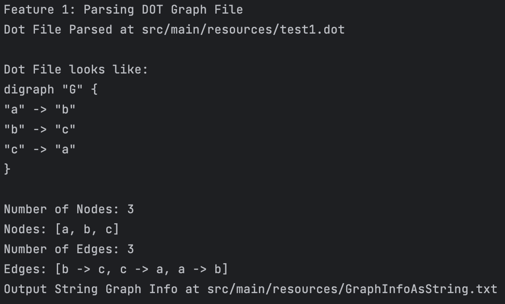
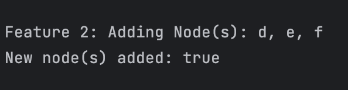
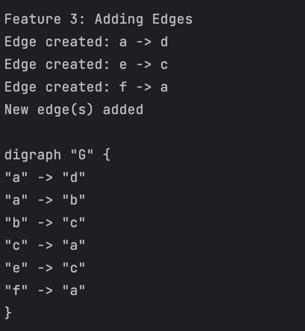
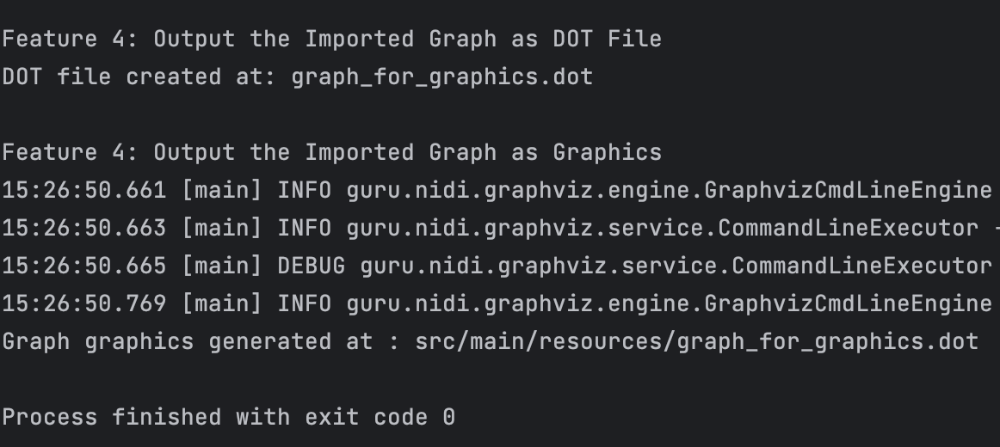

# CSE 464 Project Part 1

This Maven project, named "CSE-464-2023-amehta65", is a graph manipulator project which allows you to manipulate and work with graphs in the DOT file format. It offers several features to parse, modify, and visualize graphs. Below are instructions and example code to run the Maven project.

### Prerequisites

Before running this project, ensure that you have the following prerequisites installed on your system:

1. Java Development Kit (JDK)
2. Apache Maven
3. Git (for cloning the project repository)

### Getting Started

Follow these steps to get started with the Graph Manipulator project:

1. **Clone the Repository (optional):** You can clone the project repository from [GitHub](https://github.com) or download the source code as a ZIP archive.

   ```bash
   git clone https://github.com/AviMehta90/CSE-464-2023-amehta65.git
   ```

2. **Navigate to the Project Directory:** Open a terminal or command prompt, and change your current directory to the project's root folder.

   ```bash
   cd CSE-464-2023-amehta65
   ```

3. **Compile and Build the Project:** Use Maven to compile and build the project. This command will download the required dependencies and create an executable JAR file.

   ```bash
   mvn clean package
   ```

4. **Run the maven project (JUnitTesting)**

   ```bash
   mvn test
   ```

### Features in `GraphManipulator` Class

#### Feature 1: Parse a DOT Graph File

##### `parseGraph(String filePath)`

This function parses a DOT graph file to create a graph. It takes the file path as an argument and reads the DOT file to build the graph. If successful, it sets the graph `g` and provides information about the number of nodes and edges in the parsed graph.

#### Information Functions

##### `getNumberOfNodes()`

This function returns the total number of nodes in the parsed graph.

##### `getNodeLabels()`

Returns a set of node labels in the parsed graph, including a label indicating the number of nodes.

##### `getNumberOfEdges()`

Returns the total number of edges in the parsed graph.

##### `getEdgeInfo()`

Returns a set of edge information in the parsed graph, where each entry represents an edge in the format "Source Node -> Destination Node."

##### `toGraphString()`

Returns a formatted string that combines information about the nodes and edges of the parsed graph.

##### `outputGraph(String filePath)`

This function writes the information about nodes and edges to a text file at the specified file path and returns the contents of the created file as a string.

#### Feature 2: Adding Nodes

##### `addNode(String label)`

Adds a node with the specified label to the graph. If a node with the same label already exists, it won't be added again. Returns `true` if the node is added successfully, or `false` if the node already exists.

##### `addNodes(String[] labels)`

Adds multiple nodes with the labels provided in the `labels` array. If any of the provided labels already exist in the graph, the function won't add them. Returns `true` if at least one new node is added, or `false` if all provided labels already exist.

#### Feature 3: Adding Edges

##### `addEdge(String srcLabel, String dstLabel)`

Adds an edge between two nodes in the graph based on their labels. The function ensures that both the source and destination nodes exist in the graph before adding the edge.

#### Feature 4: Output the Imported Graph

##### `outputDOTGraph(String filename)`

This function renders the imported graph as a DOT file and saves it with the specified filename. The rendered DOT file will be located in the specified directory.

##### `outputGraphics(String filePath)`

Visualizes the graph as a PNG image. It takes a path to a DOT file as input, reads the graph from that file, and generates a PNG image file. The generated image will be located in the specified directory.

#### Feature 5: Part 2 Changes

##### `removeNode(String label)`

To remove a node, use the removeNode method and provide the label of the node you want to remove.

##### `removeNodes(String[] label)`

To remove multiple nodes, pass an array of strings and use the removeNodes method and provide the labels of the nodes you want to remove.

##### `removeEdge(String srcLabel, String dstLabel)`

To remove an edge, use the removeEdge method and provide the label of the source and destination nodes you want to remove.

##### `graphSearch(srcNode, dstNode)`

You can perform a graph search between two nodes using either a breadth-first or depth-first search algorithm. Use the graphSearch method with the desired search algorithm based on the enum in the main class.
The path of the search algorithm will be stored in a class named Path which will output in the format "a -> b -> c"

### Running the Application

Now that you've built the project, you can run the `GraphManipulator` application. Here are some examples of how to use it:

1. **Parsing a DOT File:**

- To parse a DOT graph file and display node and edge information, use the following code:

  ```java
  GraphManipulator manipulator = new GraphManipulator();
  manipulator.parseGraph("path/to/your/graph.dot");
  System.out.println(manipulator.toGraphString());
  ```
-  **Console Output**
  

2. **Adding Nodes:**

- You can add nodes to the imported graph using the `addNode` method. If the label already exists, it won't be added again.

  ```java
  GraphManipulator manipulator = new GraphManipulator();
  manipulator.parseGraph("path/to/your/graph.dot");
  manipulator.addNode("NewNode");
  ```
-  **Console Output**
   
      

3. **Adding Edges:**

- To add edges between existing nodes in the graph, use the `addEdge` method. Provide the labels of the source and destination nodes.

  ```java
  GraphManipulator manipulator = new GraphManipulator();
  manipulator.parseGraph("path/to/your/graph.dot");
  manipulator.addEdge("Node1", "Node2");
  ```
-  **Console Output**
   

4. **Output as DOT File:**

- You can output the imported graph as a DOT file with the following code. This will create a DOT file in the specified location.

  ```java
  GraphManipulator manipulator = new GraphManipulator();
  manipulator.parseGraph("path/to/your/graph.dot");
  manipulator.outputDOTGraph("output_graph.dot");
  ```

5. **Output as Graphics:**

- To visualize the graph as a PNG image, provide the path to the DOT file and specify the output file path.

  ```java
  GraphManipulator manipulator = new GraphManipulator();
  manipulator.outputGraphics("path/to/your/graph.dot");
  ```
-  **Console Output**
   

6. **Remove Node(s):**

- To check node(s) removal functionality.
  ```java
     GraphManipulator manipulator = new GraphManipulator();
     manipulator.parseGraph("path/to/your/graph.dot");
     manipulator.addNode("Node1");
     manipulator.addNodes(String[]{"Node2", "Node3"});  
     manipulator.removeNode("Node1");
     manipulator.removeNode("NonexistentNode");
     manipulator.removeNodes(String[]{"Node2", "Node3"});
     manipulator.removeNodes(String[]{"NonExNode2", "NonExNode3"});
     ```
- **Console Output Remove Node(Test Case)**

- **Console Output Remove Nodes(Test Case)**


7. **Remove Edge:**

- To check remove edge functionality.
   ```java
     GraphManipulator manipulator = new GraphManipulator();
     manipulator.parseGraph("path/to/your/graph.dot");
     manipulator.addNode("Node1");
     manipulator.addEdge(String[]{"Node1", "Node2"});
     manipulator.removeEdge(String[]{"Node1", "Node2"});
     manipulator.removeEdge(String[]{"NonExNode2", "NonExNode3"});
     ```
- **Console Output Remove Edge(Test Case)**


8. **Creating maven.yml for native CI/CD on github (under actions tab in the repository)**


9. **Creating branches and Merging Conflicts:**
- Creating bfs and dfs branch and merging with main branch
```zsh
git checkout -b bfs
```
Do the changes in bfs branch and type the following command:
```zsh
git add .
git commit -m "Added BFS Search Algorithm"
git push origin bfs
```
Go back to main branch
```zsh
git checkout main
```
Create dfs branch
```zsh
git checkout -b dfs
```
Do the changes in dfs branch and type the following command:
```zsh
git add .
git commit -m "Added DFS Search Algorithm"
git push origin dfs
```
Now merge the dfs and bfs with main branch by checking in individual branches
```zsh
git checkout main
git merge bfs
git merge dfs
```
Merge conflicts and then commit and push to main origin
```zsh
git add .
git commit -m "Resolved merge conflicts and added algorithm selection in graphSearch"
```


10. **Graph Search(BFS):**

- Checking the BFS search algorithm.
    ```java
    GraphManipulator gM = new GraphManipulator();
    gM.addNode("d");
    gM.addNodes(new String[]{"e", "f"});
    gM.addEdge("a", "d");
    gM.addEdge("e", "c");
    gM.addEdge("f", "a");
    GraphManipulator.Path path1 = gM.graphSearch("a", "c", GraphManipulator.Algorithm.BFS);
    System.out.println("Performing BFS");
    System.out.println(path1);
    ```

11. **Graph Search(DFS):**

- Checking the DFS search algorithm.
    ```java
    GraphManipulator gM = new GraphManipulator();
    gM.addNode("d");
    gM.addNodes(new String[]{"e", "f"});
    gM.addEdge("a", "d");
    gM.addEdge("e", "c");
    gM.addEdge("f", "a");
    GraphManipulator.Path path1 = gM.graphSearch("a", "c", GraphManipulator.Algorithm.DFS);
    System.out.println("Performing DFS");
    System.out.println(path1);
    ```

- **Console Output Graph Search(Test Case)**


### Refactoring Changes:

1. **Filename change**
    - **File Changes** `new_graph_image.png`
    - **Reason:** Snake Casing for better readability

2. **Instantiated Global String Variables**
    - **Variables Added** `EDGE_DELIMITER = "->"` and `PATH_PREFIX = "src/main/resources/"`
    - **Reason:** Accessible to all parts of the program. The intent is to protect data from being changed.

3. **Error Handling**
    - **Changes Made:** Error message in outputDOTGraph changed to `"Error creating DOT file: " + e.getMessage()`
    - **Reason:** Easy Identification of Program Code and Error-Handling Code.

4. **Extracted Method:**
    - **Method Renamed:** `modifyNodes` Method added
    - **Reason:** Added to check whether adding or deleting node in a single method making the original methods less complex and readable.

5. **String Format**
    - **Changes Made:** `String.format("%s%s%s", srcLabel, EDGE_DELIMITER, dstLabel);`
    - **Reason:** The format string provides a clear template for the resulting string, making it easier to understand the structure. The String.format method supports localization by allowing you to specify different format patterns based on the locale.


## Code Patterns

### Template Pattern

This branch of the project introduces a refactoring of the `GraphManipulator` class by applying the template pattern. The goal is to abstract common steps in the BFS (Breadth-First Search) and DFS (Depth-First Search) algorithms and provide a more modular and maintainable solution.

#### Changes Made

1. **Base Class - GraphSearchAlgorithm:**
    - Created a new base class `GraphSearchAlgorithm` to define the common steps for both BFS and DFS.
    - Moved the common initialization, path retrieval, and overall search structure to this base class.

2. **Subclasses - BFSAlgorithm and DFSAlgorithm:**
    - Created two subclasses, `BFSAlgorithm` and `DFSAlgorithm`, that extend `GraphSearchAlgorithm`.
    - Implemented algorithm-specific steps such as retrieving the next node and processing neighbors.
    - Implemented a single linked list structure for both the classes. The difference stands in the handling of neighbours where in BFS th behaviour of the linkedlist is queue and in DFS it is a stack.

3. **Refactoring in GraphManipulator:**
    - Updated the `GraphManipulator` class to use the new template pattern.
    - The `graphSearch` method now creates an instance of the appropriate algorithm based on the selected type (BFS or DFS).

## Usage

1. **BFS Search:**
   ```java
   GraphManipulator graphManipulator = new GraphManipulator();
   GraphManipulator.Path path = graphManipulator.graphSearch("sourceLabel", "destinationLabel", GraphSearchAlgorithm.Algorithm.BFS);
   ```

2. **DFS Search:**
   ```java
   GraphManipulator graphManipulator = new GraphManipulator();
   GraphManipulator.Path path = graphManipulator.graphSearch("sourceLabel", "destinationLabel", GraphSearchAlgorithm.Algorithm.DFS);
   ```


### Strategy Pattern

#### Strategy Interface (`GraphSearchStrategy`)

- **Purpose**: To define a common interface for all graph search strategies.
- **Methods**: Declares the method `graphSearch(String srcLabel, String dstLabel)`.
- **Usage**: Implemented by `BFSAlgorithm` and `DFSAlgorithm`.

#### Concrete Strategies (`BFSAlgorithm` and `DFSAlgorithm`)

- **BFSAlgorithm**:
    - **Inherits**: `GraphSearchAlgorithm`.
    - **Implements**: `GraphSearchStrategy`.
    - **Behavior**: Implements the BFS algorithm for graph searching.
    - **Method**: `graphSearch` overridden to provide BFS specific logic.

- **DFSAlgorithm**:
    - **Inherits**: `GraphSearchAlgorithm`.
    - **Implements**: `GraphSearchStrategy`.
    - **Behavior**: Implements the DFS algorithm for graph searching.
    - **Method**: `graphSearch` overridden to provide DFS specific logic.

#### Context Class (`GraphManipulator`)

- **Responsibility**: Manages the graph and delegates the search operation to the current strategy.
- **Key Method**:
    - `setSearchStrategy(GraphSearchStrategy strategy)`: Sets the current search strategy.
    - `graphSearch(String srcLabel, String dstLabel)`: Delegates the search to the chosen strategy.

#### Test Code

- **Setting Strategy**: We can dynamically set the desired search strategy (BFS or DFS) using `setSearchStrategy`.
- **Searching**: Once the strategy is set, calling `graphSearch` on `GraphManipulator` executes the search based on the selected strategy.

#### Usage Example

```java
GraphManipulator manipulator = new GraphManipulator();

// Setting BFS as the strategy
manipulator.setSearchStrategy(new BFSAlgorithm(graph));
Path bfsPath = manipulator.graphSearch("source", "destination");

// Switching to DFS
manipulator.setSearchStrategy(new DFSAlgorithm(graph));
Path dfsPath = manipulator.graphSearch("source", "destination");
```

#### Advantages

- **Flexibility**: Easily switch between different algorithms at runtime without modifying the core logic.
- **Scalability**: New search strategies can be added without changing the existing codebase.
- **Maintainability**: Each algorithm is encapsulated in its own class, making it easier to manage and modify.


### Project Structure

The project's source code is organized as follows:

- `src/main/java/org/mehtaavi`: Contains the Java source code.
- `src/test/java/org/mehtaavi`: Contains the Java test code.
- `src/main/resources`: Place your DOT files here and specify the output directory for graphics.

### Commit Links
1. [First Commit](https://github.com/AviMehta90/CSE-464-2023-amehta65/commit/77fd7c4e6149defa7fdd8442712f1af9b1000bf8)
2. [First Feature Added](https://github.com/AviMehta90/CSE-464-2023-amehta65/commit/35312ce12fba171d711c92cc22cd31964deb1585)
3. [Second Feature Added](https://github.com/AviMehta90/CSE-464-2023-amehta65/commit/1e70a3a696c06c74c99d12cb7671f061f0d48229)
4. [Third Feature Added](https://github.com/AviMehta90/CSE-464-2023-amehta65/commit/dc4d21d1a18d73dd2479f9f47298cfcb5b557d60)
5. [Fourth Feature Added](https://github.com/AviMehta90/CSE-464-2023-amehta65/commit/ee982ac86ffc866294c204f5efae84bd8e9f7f04)
6. [Deleted 'example' directory](https://github.com/AviMehta90/CSE-464-2023-amehta65/commit/e68cced851dc420aab9b1c585ead665c24f2ced0)
7. [code formatted](https://github.com/AviMehta90/CSE-464-2023-amehta65/commit/7fae8289b50194dfa9a8f63cf4f826aa6782ca26)
8. [Final Upload](https://github.com/AviMehta90/CSE-464-2023-amehta65/commit/3fc60dcaeb8540cd3af3533acb8b13d656fb7793)
9. [Added 3 APIs to support node and edge removal with test unit](https://github.com/AviMehta90/CSE-464-2023-amehta65/commit/cd83a508f804194163f999037492b87810ad59f6)
10. [Create maven.yml](https://github.com/AviMehta90/CSE-464-2023-amehta65/commit/7fdd877fc33f0973fc688fb4bd3f5d59c1a63432)
11. [Update maven.yml](https://github.com/AviMehta90/CSE-464-2023-amehta65/commit/e1cb262616d65c54393a7b81694d9b546e557f89)
12. [Added BFS graph search API](https://github.com/AviMehta90/CSE-464-2023-amehta65/commit/f8f3126e7ae0e2a363079835d10a63160d0b3b2b)
13. [Name corrected for BFS API graphsearch](https://github.com/AviMehta90/CSE-464-2023-amehta65/commit/8848415618f8097bb20b719436c74085f132c2be)
14. [Implemented DFS graph search API](https://github.com/AviMehta90/CSE-464-2023-amehta65/commit/61d5e58474f25d47a2cefd140e30f097ef1d3cdb)
15. [Conflicts merge](https://github.com/AviMehta90/CSE-464-2023-amehta65/commit/2d2a8f7978f75b7b100824c9c718d397590ad3b4)
16. [Merged changes with enum and added test case](https://github.com/AviMehta90/CSE-464-2023-amehta65/commit/c7f68aa17750f623291a66b87a26933fb97f38a6)
17. [Formatting changes](https://github.com/AviMehta90/CSE-464-2023-amehta65/commit/802957f83b2a6f669d7c00bf833fb5f39db88623)
18. [Refactoring changes](https://github.com/AviMehta90/CSE-464-2023-amehta65/pull/1/commits/9760a1abf7a21e8b480a819316ae1aebf8eba3b3)
19. [Template Pattern](https://github.com/AviMehta90/CSE-464-2023-amehta65/pull/1/commits/a0d26cbcb1e9c4a161f68d68a46d4189c4f190b2)
20. [Strategy Pattern](https://github.com/AviMehta90/CSE-464-2023-amehta65/commit/a4292a017912de3795dd5681cdc6700660e4cd9d)